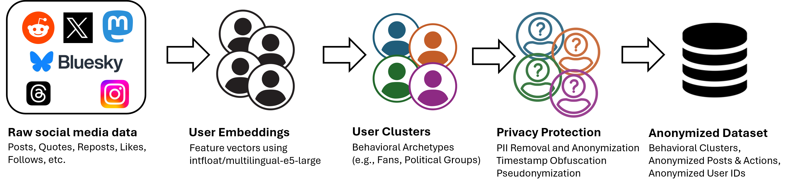

# BluePrint: A Social Media User Dataset for LLM Persona Evaluation and Training

## Clustering

The [clustering](clustering/) folder contains code for pre-processing, computing embeddings, and clustering. Please read the [README.md](clustering/README.md) enclosed within.

## PII Removal

For our data release, we removed all personally-identifiable information (PII) from the dataset. The code can be found at [bluesky_persona_pii](https://github.com/jeqcho/bluesky_persona_pii/tree/main). Please read the [README.md](https://github.com/jeqcho/bluesky_persona_pii/tree/main/README.md) enclosed within.

## License

MIT License